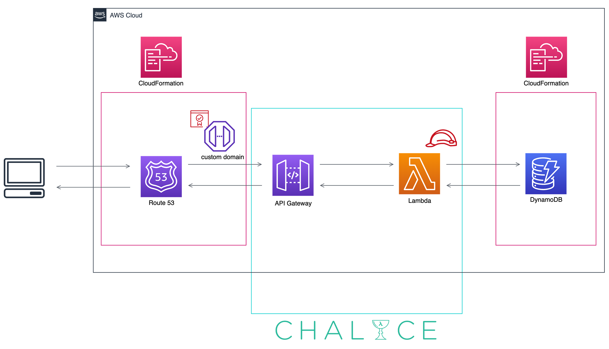

Architecture of todo-app
===

- Use **AWS Chalice** to create Amazon API Gateway and AWS Lambda functions.  
  [Getting Started — Python Serverless Microframework for AWS 1.12.0 documentation](https://chalice.readthedocs.io/en/latest/)
- Use **CloudFormation** to create Amazon DynamoDB and a Usage Plan in API Gateway.

## About DynamoDB table

### table name

todo-app

### attributes

| attribute name | type | key type |
|---|---|---|
| `user_id` | string | HASH |
| `todo_id` | string | RANGE |
| `title` | string | - |
| `content` | string | - |
| `done` | string | - |
| `l_idx_done` | string | RANGE (LSI) |

### index

| index name | hash key | range key |
|---|---|---|
| (primary) | `user_id` | `todo_id` |
| FilterDoneIndex | `user_id` | `l_idx_done` |
